# Read Me Part B
## One Good Street 
A Web App by Molly Madden and Michelle Wong

## R1 At a minimum use the following technologies: Mongo / Mongoose Express React.js Node.js
For our web app we implemented the following technologies:
* Mongo / Mongoose
* Express
* React JS
* Node JS

## R2 Write well designed code that: Separates the program into modules that each deal with one particular focus, or concern; Demonstrates DRY (Don’t Repeat Yourself) coding principles; Uses appropriate libraries; Demonstrates good code flow control for user stories; Applies Object Oriented (OO) principles/patterns; Uses appropriate data structures

### Program separated into modules with one particular focus
Our program is separated into frontend and backend code. 

The backend is further separated into controllers, models and routes. Controllers is where all the code goes for application logic. Controllers are the link between models and views. They pass requests from the web browser, querying models for specific data and then pass the retrieved data to the views. For example in the item-controller.js, this is where the CRUD functionality for our Items model is found. Models manages the data of our program and is where our schema for creating objects is found. This is where Mongoose is used to translate between how the data object is represented in MongoDB and how it is represented in code. For example, our User model schema shows that data will be organised and stored in MongoDB based on this structure:
```
const userSchema = new Schema(
  {
    firstName: {
      type: String
    },
    lastName: {
      type: String
    },
    email: {
      type: String,
      required: true,
      unique: true
    },
    password: {
      type: String
    },
    isAdmin: {
      type: Boolean,
      default: true
    }
  },
  {
    timestamps: true
  }
);
```

Routes are where the routing code for the project is stored. It associates a HTTP verb such as GET, POST , PUT , DELETE with a URL path, and a function that is called to handle this path.

The frontend is separated into various components which each attempt to serve a singular purpose. For example, the index.jsx file of the homepage renders the following components: a header, admin navbar, title, hero image, heat map, contact form and footer. The header component is further broken down to render a logo and navbar component. Static filler text has not been separated into components because they will not be reused or referred to elsewhere.

### Demonstrates DRY coding principles
DRY coding principles were adhered to as much as possible throughout the project. For example, when we created a form for listing an item. We created a 'base' redux form component in the front end that is rendered for both the 'edit' and 'create' items forms. This 'base' form also contains validations. By having this 'base' form it allowed us to not repeat our code for both the create and edit forms, as coding for these two components were very similar. 

Our base form - Form.jsx

```Javascript
//This is the base form component for the edit and create item component. It renders for both edit and create
//It calls on the 'handleSubmit' function that is like a middle-layer for this form's submit handlers - see index.jsx and createItem.jsx and editItem.jsx 
//Form validations are handled here. 


import React from 'react';
import { Field, reduxForm } from 'redux-form';
import '../../Shared/form-styling.css';


//Form validation

function validate(values) {
    let errors = {};

    if (!values.itemName) {
        errors.itemName = 'Required'
    }

    if (!values.description) {
        errors.description = 'Required'
    }

    if (!values.category) {
        errors.category = 'Required'
    }

    if (!values.postcode) {
        errors.postcode = 'Required'
    }

    if (!values.firstName) {
        errors.firstName = 'Required'
    }

    if (!values.lastName) {
        errors.lastName = 'Required'
    }

    if (!values.email) {
        errors.email = 'Required'
    }
    else if (!/^[A-Z0-9._%+-]+@[A-Z0-9.-]+\.[A-Z]{2,4}$/i.test(values.email)) {
        errors.email = 'Invalid email address'
    }

    if (!values.privacy) {
        errors.privacy = 'Required'
    }
    return errors;
}

//Rendering for the drop down box
const renderSelectField = ({ input, label, type, meta: { touched, error }, children }) => (
    <div>
        <label>{label}</label>
        <div>
            <select {...input}>
                {children}
            </select>
            {touched && error && <span>{error}</span>}
        </div>
    </div>
)

class Form extends React.Component {

    renderField({ input, label, type, meta: { touched, error, warning } }) {
        //console.log(input)
        return (
            <div>
                <label>{label}</label>
                <div>
                    <input {...input} placeholder={label} type={type} />
                    {touched &&
                        ((error && <span>{error}</span>) ||
                            (warning && <span>{warning}</span>))}
                </div>

            </div>

        );
    }

    render() {

        return (<div className="mainform">

            <form onSubmit={this.props.handleSubmit}>
                <div className="form-group">

                    <Field name="itemName" component={this.renderField} type="text" label="Item name"></Field>
                </div>
                <div className="form-group">
                    <Field name="headline" component={this.renderField} type="text" label="Headline"></Field>
                </div>
                <div className="form-group">
                    <Field name="description" component={this.renderField} type="text" label="Description"></Field>
                </div>
                <div className="form-group">
                    <Field
                        name="category"
                        component={renderSelectField}
                        type="category"
                        label="Category">
                        <option></option>
                        <option value="Bedroom">Bedroom</option>
                        <option value="Braces and support">Braces and Support</option>
                        <option value="Dressing and Grooming">Dressing and Grooming</option>
                        <option value="Orthotics and Footcare">Exercise and therapy</option>
                        <option value="Furniture">Furniture</option>
                        <option value="Household Aid">Household Aid</option>
                        <option value="Kitchen">Kitchen</option>
                        <option value="Mobility">Mobility</option>
                        <option value="Orthotics and footcare">Orthotics and Footcare</option>
                        <option value="Toileting">Toileting</option>
                        <option value="Other">Other</option>
                    </Field>
                </div>

                <div className="form-group">
                    <Field name="postcode" component={this.renderField} type="text" label="Postcode"></Field>
                </div>
                <div className="form-group">
                    <Field name="firstName" component={this.renderField} type="text" label="First Name"></Field>
                </div>
                <div className="form-group">
                    <Field name="lastName" component={this.renderField} type="text" label="Last Name"></Field>
                </div>
                <div className="form-group">
                    <Field name="phone" component={this.renderField} type="text" label="Phone"></Field>
                </div>
                <div className="form-group">
                    <Field name="address" component={this.renderField} type="text" label="Address"></Field>
                </div>
                <div className="form-group">
                    <Field name="email" component={this.renderField} type="text" label="Email"></Field>
                </div>
                <div className="form-group">
                    <Field name="privacy" component={renderSelectField} type="text" label="Privacy">

                        <option></option>
                        <option value="publishDetails">Publish my phone number and first name - I will arrange handover directly</option>
                        <option value="NotPublishDetails">Please do not publish my details - One Good Street should arrange handover</option>
                    </Field>
                </div>
                <br />


                <div className="form-group">
                    <label htmlFor="image" >Image</label>&nbsp;
                    <button type="button" onClick={this.props.showWidget}>Click here to choose an image 📷</button>
                </div>< br />
                <div className="form-group">

                    <Field name="delivery" component={this.renderField} type="checkbox" label="I can offer delivery"></Field>


                </div>
                <div>
                    <button type="submit" className="general-button">{this.props.btnText}</button>
                </div>

            </form>

            <p><strong>You cannot edit this form once submitted. For any changes, or to remove this listing, please email info@onegoodstreet.com.au</strong></p>
        </div>
        );
    }
}
// Form = reduxForm({ form: 'item' })(Form);
// export default Form;

export default reduxForm({ form: 'item', validate })(Form);
```

Our create form
```Javascript
//imports base Form.jsx here and renders the base form. 
//This component is linked by the Button component that then links to this item (CreateItem component)


import React from 'react';
import Form from './Form';
import axios from 'axios';
import Header from '../../Shared/Header';
import Title from '../../Shared/Title';
import Adminav from '../../Admin/admin-nav';
import ContactForm from '../../Shared/slider';


class CreateItem extends React.Component {
    constructor(props) {
        super(props);

        this.state = {
            itemName: '',
            headline: '',
            description: '',
            category: '', //drop down
            postcode: '',
            firstName: '',
            lastName: '',
            phone: '',
            address: '',
            email: '',
            privacy: '', //drop down
            image: '',
            delivery: '' //checkbox boolean
        }
    }
    handleCreateItem = (data) => {
        console.log(data);

        //this is pushing the image url of cloudinary to mongodb and enables the image to then render on pages of the website
        data.image = this.state.image
        console.log('data image', data.image)

        //component to say uploading?? Put in here

        axios.post(process.env.REACT_APP_BACKEND_URL + '/items/create', data)

            .then(res => {
                window.alert("Your item has been submitted for review. Please allow 72 hours for a response.");
                this.props.history.push('/library');
            })
            .catch((err) => {
                console.log(err)
            })
    }

    render() {

        const myWidget = window.cloudinary.createUploadWidget({
            cloudName: 'onegoodst',
            uploadPreset: 'onegoodst'
        }, (error, result) => {
            if (!error && result && result.event === "success") {
                console.log('Done! Here is the image info: ', result.info.url);
                this.setState({
                    image: result.info.url
                })
            }
        }
        )

        const showWidget = async () => {
            await myWidget.open()
            console.log('state image', this.state.image)

        }

        return (<div>
            <Header />
            <ContactForm />
            <Adminav />
            <Title title="Add a New Item" />
            {/* {this.state.image !== '' && <p>{this.state.image}</p>} */}
            <Form btnText={'Add Item'} onSubmit={this.handleCreateItem} showWidget={showWidget} />

        </div>
        );
    }
}

export default CreateItem;
```

Our edit form
```Javascript
//Calling base form component here in Form.jsx
// This page is being rendered by clicking on the link in tableList.jsx

import React from "react";
import Form from './Form';
import axios from 'axios';
import Header from '../../Shared/Header';
import Title from '../../Shared/Title';
import Adminav from '../../Admin/admin-nav';
import Unauthorised from "../../Shared/unauthorised";

class EditItem extends React.Component {
  constructor(props) {
    super(props);

    this.state = {
      itemName: '',
      headline: '',
      description: '',
      category: '', //drop down
      postcode: '',
      firstName: '',
      lastName: '',
      phone: '',
      address: '',
      email: '',
      privacy: '', //drop down
      image: '',
      delivery: '' //checkbox boolean
    }
  }

  handleEditItem = (data) => {

    data.image = this.state.image

    console.log('handleEdit data', data);
    //component to say uploading?? Put in here
    const option = {
      url: process.env.REACT_APP_BACKEND_URL + "/items/edit/" + this.props.match.params.id,
      method: "PUT",
      headers: {
        "authorization": `${localStorage.authToken}`
      },
      data: data

    }

    console.log(data)

    console.log('data image', data.image)

    axios(option)

      .then(res => {
        this.props.history.push('/admin/dashboard');
      })
      .catch((err) => {
        console.log(err)
      })

  }


  componentDidMount() {

    axios.get(process.env.REACT_APP_BACKEND_URL + '/items/' + this.props.match.params.id)

      .then(response => {
        console.log(response.data)
        this.setState(
          {
            itemData:

            {
              itemName: response.data.itemName,
              headline: response.data.headline,
              description: response.data.description,
              category: response.data.category,
              postcode: response.data.postcode,
              firstName: response.data.firstName,
              lastName: response.data.lastName,
              phone: response.data.phone,
              address: response.data.address,
              email: response.data.email,
              privacy: response.data.privacy,
              image: response.data.image,
              delivery: response.data.delivery,
              published: response.data.published
            }
          })


      })
      .catch(function (error) {
        console.log(error);
      })
  }

  render() {

    if (localStorage.authToken) {

      const myWidget = window.cloudinary.createUploadWidget({
        cloudName: 'onegoodst',
        uploadPreset: 'onegoodst'
      }, (error, result) => {
        if (!error && result && result.event === "success") {
          console.log('Done! Here is the image info: ', result.info.url);
          this.setState({
            image: result.info.url
          })
        }
      }
      )

      const showWidget = async () => {
        await myWidget.open()
        // console.log('state image', this.image)

      }

      return (<div>
        <Header />
        <Adminav />
        <Title title="Edit Item" />

        <Form btnText={'Submit Edit'} onSubmit={this.handleEditItem} item={this.state} initialValues={this.state.itemData} showWidget={showWidget} />


      </div>
      );
    }
    else {
      return (
        <Unauthorised />
      )
    }

  }
}

export default EditItem;
```

### Uses appropriate libraries
These are the libraries we used for our project:
* Cors - cross origin resource sharing
* Crypto - password hashing for authentication purposes
* Dotenv - to pass environment variables to Process.env
* jsonwebtoken - to ensure uniqueness of tokens for authorization purposes
* Morgan - HTTP request logger middleware
* Nodemailer - to facilitate the sending of emails
* Nodemon - to automate server restarts
* Jest & Supertest - for backend testing    
  
* Cypress - for frontend testing
* Depcheck - to ensure that unused packages & libraries were identified
* Axios - to return promises after an HTTP request
* Google-map-react - for the purpose of creating the Home page heat map
* Moment - to quickly parse MongoDB datestamps into DD-MM-YYYY format
* Font awesome - to add a Facebook and 'contact us' icon
* React-Router-Dom - declarative routing for the Document Object Model
* React-Sliding-Panel - to create a slide out contact form
* React-Tiny-Link - to show a preview of a link for the Media & Events page
* Redux-form - for easier state management of forms


## R3	Employ and utilise proper source control methodology (git)

We used git repositories to store our source code. We made around 400 commits total across both repositories. Please see the following links:

### Front end 'One Good Street' 
https://github.com/mollymadden/one-good-street-frontend

### Back end 'One Good Street'
https://github.com/themishmash/one-good-street-backend


## R4 Demonstrate your ability to work in a team: Use a recognised project management methodology; Use a recognised task delegation methodology

We used Trello to keep track of tasks. Please see the screens shots below of our Trello board.

Trello 30-1-20
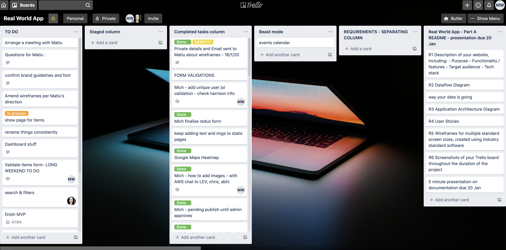

Trello 29-1-20 - 2
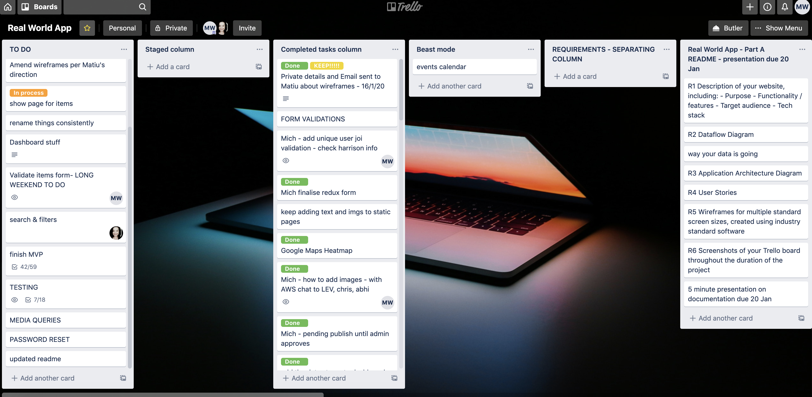

Trello 29-1-20 - 1
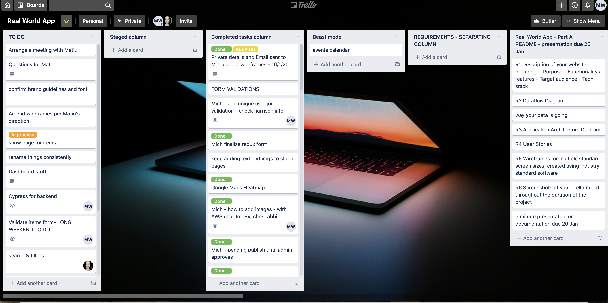

Trello 28-1-20 - 2
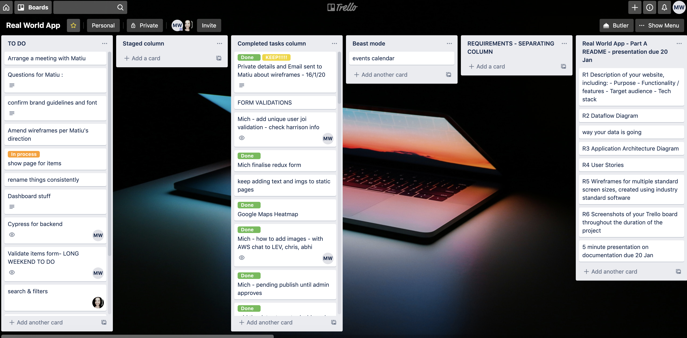

Trello 28-1-20 - 1
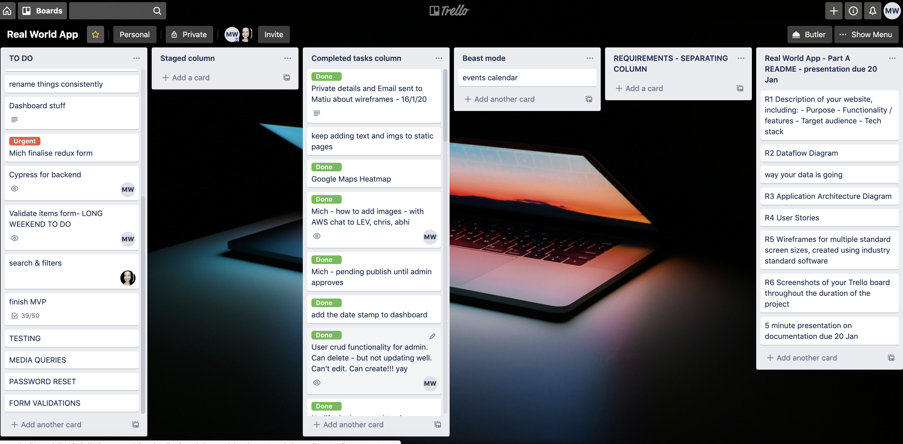

Trello 26-1-20
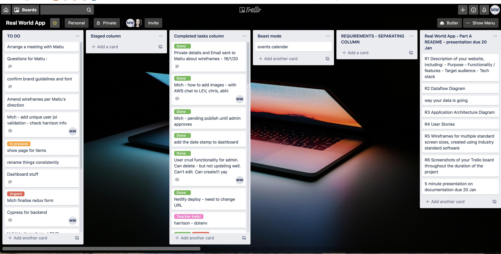

Trello 24-1-20
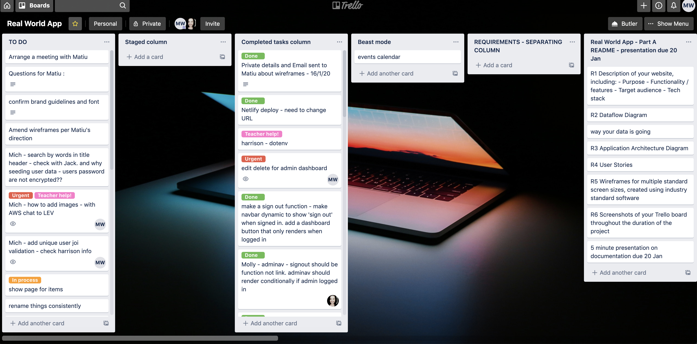

Trello 22-1-20
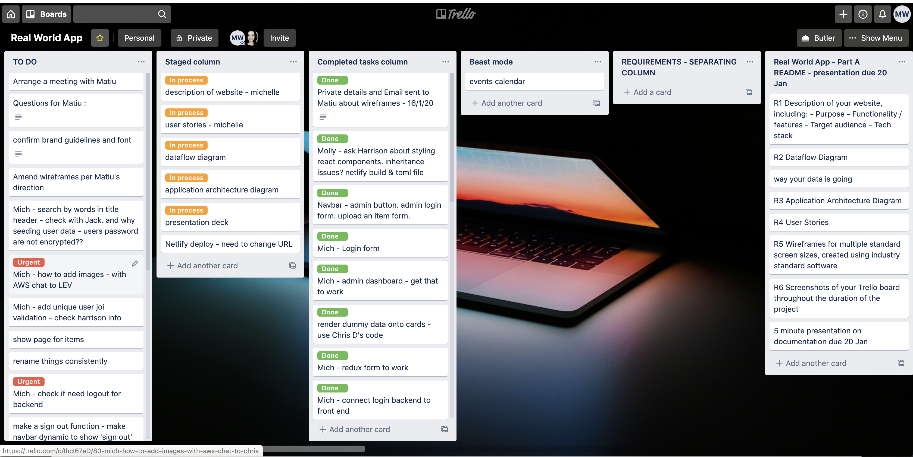

Trello 21-1-20


Trello 20-1-20
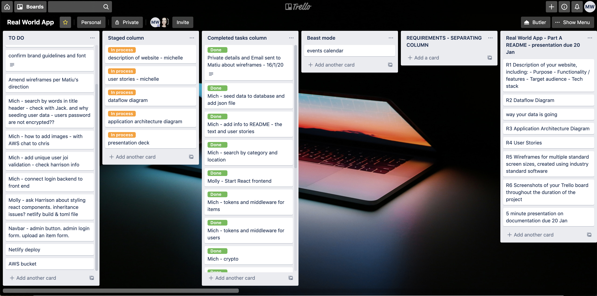


## R5	Produce a working application that meets client and user needs

Our application works as intended, and we communicated with Matiu Bush via email and phone.

Please see the screenshot below of some email correspondence. 

Email correspondence
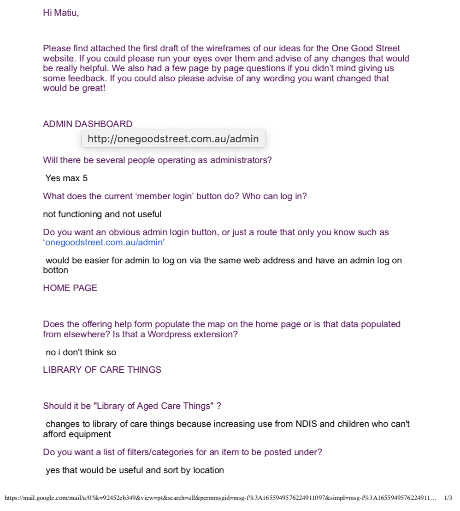
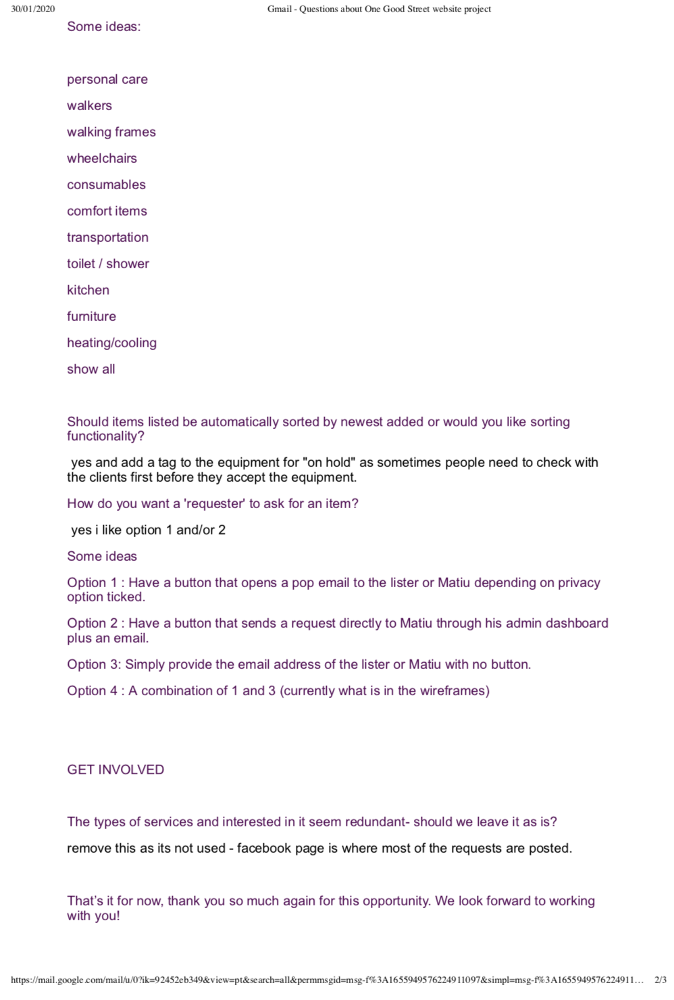

## R6	Deploy the application to a cloud hosting service
Our application utilises MongoDB cloud, Cloudinary, Heroku and Netlify.

Heroku Backend:
https://vast-headland-25884.herokuapp.com/items/
(or /users)

Netlify Frontend
https://one-good-street.netlify.com/

## R7	Produce an application with an intuitive user interface

Here are screenshots of our website:

One Good Street - Home Page
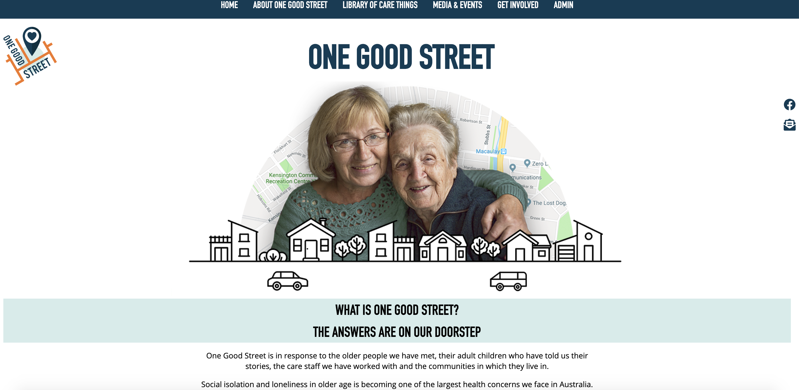

One Good Street - About page
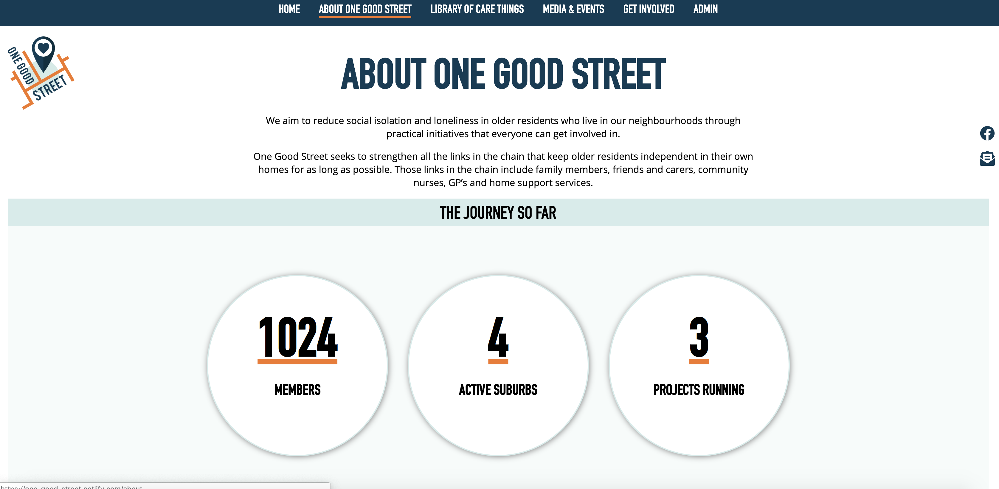

One Good Street - Library
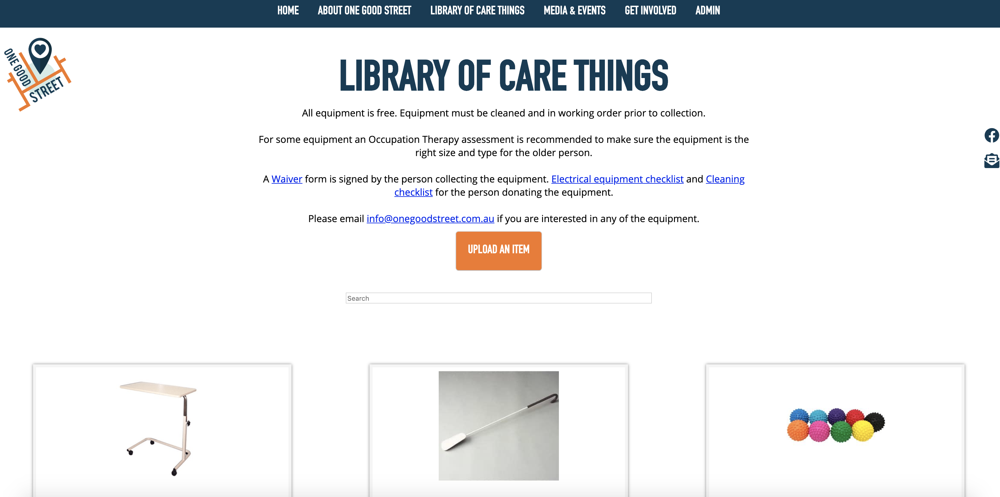

One Good Street - Add item
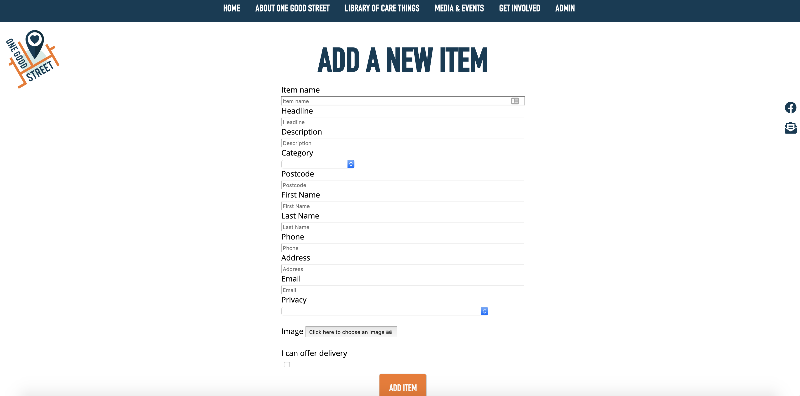

One Good Street - Get Involved
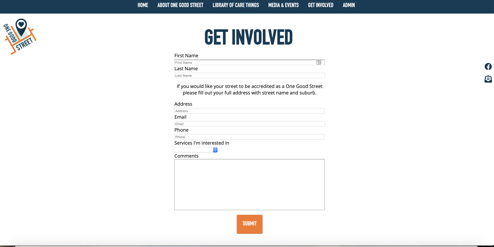

One Good Street - Media & Events
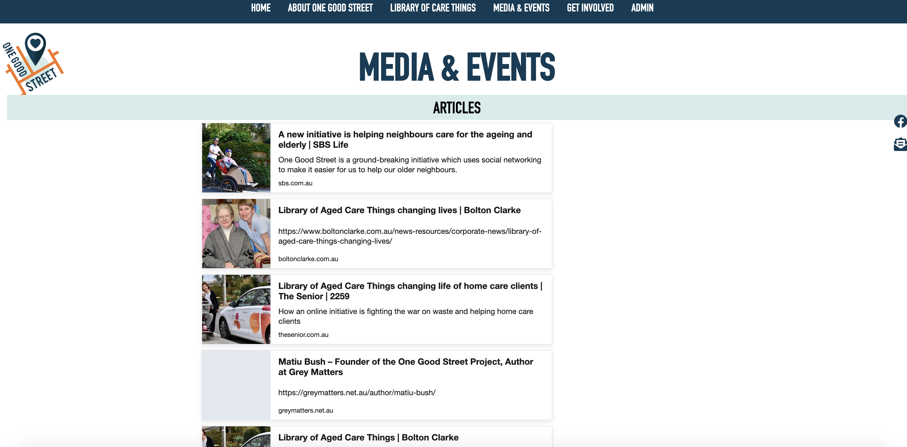

One Good Street - Admin login
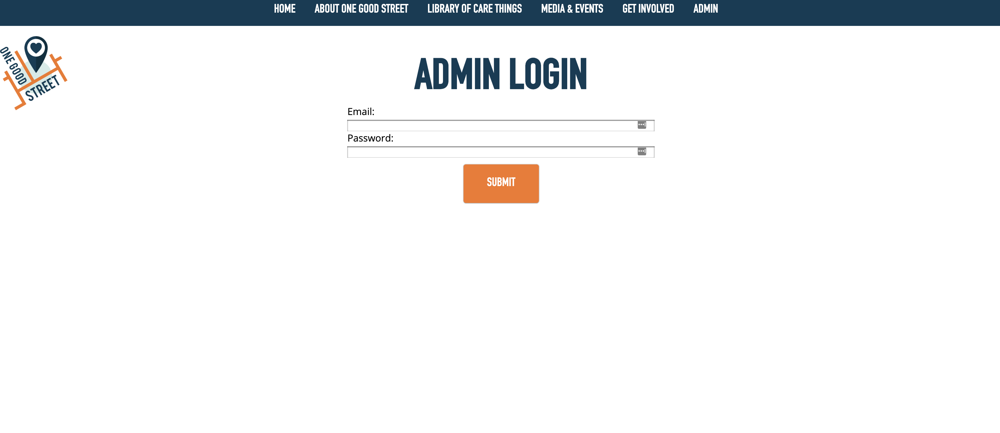

One Good Street - Admin Dashboard
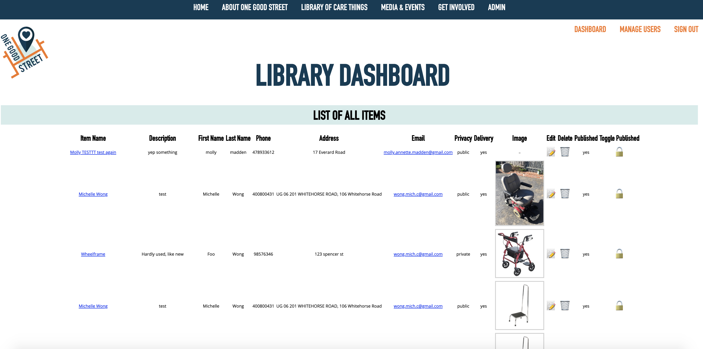

One Good Street - Admin Manage users
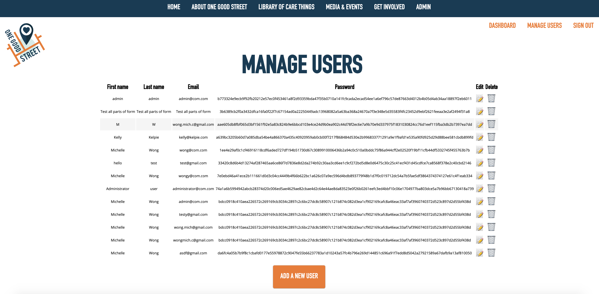


## R8	Provides evidence of user testing: In the development environment and In the production environment

### Development testing 

We wrote several tests to the front end whilst in the development environment. It is found in the Cypress folder -> Integration -> one-good-street.

We also added several tests to the back end using Supertest and Jest.

Cypress testing of creating item form:

```Javascript
//With validations

//Create item
describe("testing creating item locally", function() {
  it("Visits upload form to create an item, filling in each field and item is successfully uploaded", function() {
    cy.visit("http://localhost:3000");
    cy.contains("LIBRARY").click();
    cy.contains("Upload").click();
    cy.get("input[name=itemName]").type("test");
    cy.get("input[name=headline]").type("test");
    cy.get("input[name=description]").type("test");
    cy.get("select[name=category]").select("Bedroom");
    cy.get("input[name=postcode]").type("test");
    cy.get("input[name=firstName]").type("test");
    cy.get("input[name=lastName]").type("test");
    cy.get("input[name=phone]").type("98576346");
    cy.get("input[name=address]").type("test");
    cy.get("input[name=email]").type("test@com.com");
    cy.get("select[name=privacy]").select("NotPublishDetails");
    cy.get("input[name=delivery]").check();
    cy.contains("Add Item").click();
    
  });
});

//Edit item
describe("testing editing item locally as admin user", function() {
  it("visits admin dashboard to edit an item as an admin user and edits the item successfully with the words testing edit", function() {
    cy.visit("http://localhost:3000");
    cy.contains("ADMIN").click();
    cy.get("input[name=email]").type("admin@com.com");
    cy.get("input[name=password]").type("admin");
    cy.contains("Submit").click();
    cy.contains("DASHBOARD").click();
    cy.contains("📝").click();
    cy.get("input[name=itemName]").type("testing edit");
    cy.contains("Submit Edit").click();

  });
});

//Viewing item from admin dashboard
describe("testing viewing item locally as admin user from admin table", function() {
  it("Visits admin dashboard as an admin user to view an item by clicking on the item name and views item successfully", function() {
    cy.visit("http://localhost:3000");
    cy.contains("ADMIN").click();
    cy.get("input[name=email]").type("admin@com.com");
    cy.get("input[name=password]").type("admin");
    cy.contains("Submit").click();
    cy.contains("DASHBOARD").click();
    cy.contains("testtesting edit").click();
   
  });
});

//add the toggle publish, then view the item on library page and click into object. 
describe("testing toggling item to published as admin user", function() {
  it("visits admin dashboard to publish an item as an admin user and the item is then rendered on the library of care things, seen by visiting the library of care things page", function() {
    cy.visit("http://localhost:3000");
    cy.contains("ADMIN").click();
    cy.get("input[name=email]").type("admin@com.com");
    cy.get("input[name=password]").type("admin");
    cy.contains("Submit").click();
    cy.contains("DASHBOARD").click();
    cy.contains("🔐").click();
    cy.contains("LIBRARY OF CARE THINGS").click();
    cy.contains("DASHBOARD").click();
    cy.contains("🔓").click();
    cy.contains("LIBRARY OF CARE THINGS").click();
  });
});

//delete item
describe("testing deleting item locally as admin user", function() {
  it("Visits admin dashboard as an admin user to delete an item and deletes the item successfully", function() {
    cy.visit("http://localhost:3000");
    cy.contains("ADMIN").click();
    cy.get("input[name=email]").type("admin@com.com");
    cy.get("input[name=password]").type("admin");
    cy.contains("Submit").click();
    cy.contains("DASHBOARD").click();
    cy.contains("🗑").click();

  });
});

```

### Production testing

We tested our site manually in production. 

Please see this youtube recording of our site that is being hosted on Netlify.

[One Good Street Production Testing](https://www.youtube.com/watch?v=Pv9xlRiM61E&feature=youtu.be)

## R9	Utilises a formal testing framework
We used Cypress for automated testing of the front end and Supertest/Jest for testing the back end. 

For the front end on localhost, we used Cypress automated testing on as many links as possible on each page, including the nav, admin nav, all buttons, contact form, facebook link, and all links nested in text. We also tested the functionality of nearly all forms and search fields, to the extent at which external intervention was required, such as in the case where a form sends an email via nodemailer that is required to complete a function (reset password, notify admin of new listing, etc.) Further, we tested the validation of all form fields, to ensure that email, phone number, and postcode fields received the correct type of data, as well as making sure that any form with a field marked as 'required' would not submit without these fields being completed.

We thoroughly tested the admin login function to ensure that only registered users could access restricted pages, and that the forms would not accept any invalid or null data.

For the back end, we used Supertest to automate testing of CRUD functionality for both items and users. We also tested the routes of sending forms and requesting a password reset.

## R10	A link (URL) to your deployed website

[One Good Street Netlify](https://one-good-street.netlify.com/)

## R11	A link to your GitHub repository (repo) Ensure the repo is accessible by your educators!

### Front end 'One Good Street' 
https://github.com/mollymadden/one-good-street-frontend

### Back end 'One Good Street'
https://github.com/themishmash/one-good-street-backend
